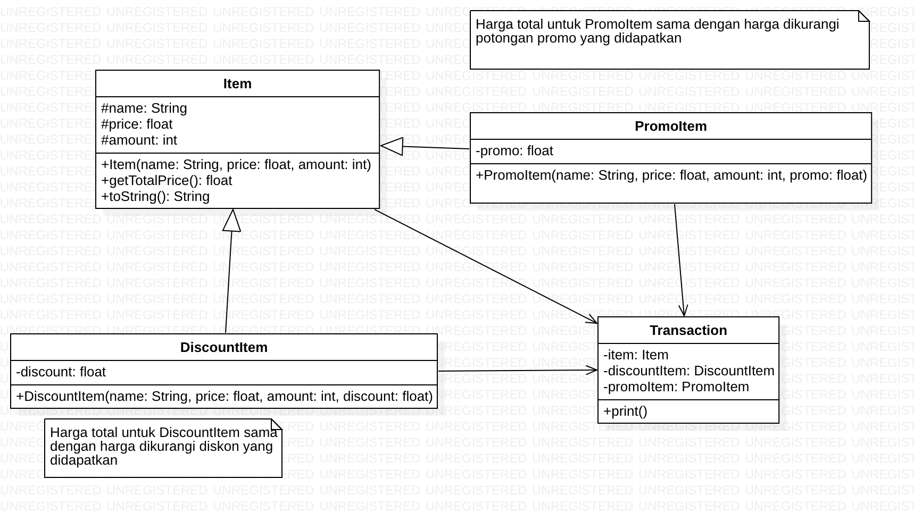
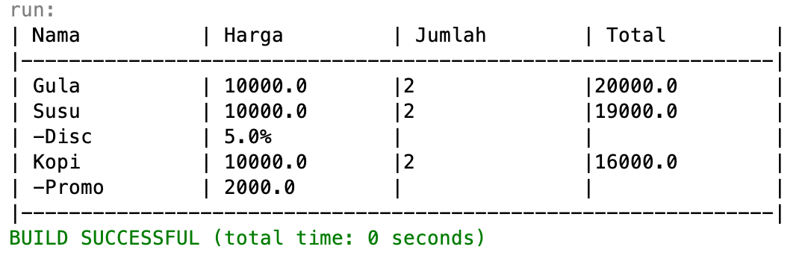

# UTS

## Langkah Pengerjaan
- Silahkan install plugins [Wakatime](https://wakatime.com) pada IDE netbeans
 anda. (Registrasi akun wakatime jika anda belum mempunyai akun.)
- Ikuti langkah instalasi plugins pada alamat berikut
 https://wakatime.com/netbeans
- Fork repository ini ke akun github anda.
- Setelah proses fork selesai, lakukan clone pada repository hasil fork
 tersebut.
- Tambahkan file `wakatime.txt` yang berisi url username akun wakatime anda!

- Lengkapi project tersebut berdasarkan diagram class berikut.

  

  > Pada diagram class tidak dituliskan setter dan getter secara detail, silahkan
  > tambahkan jika diperlukan

- Tambahkan komentar deskriptif untuk setiap baris kode yang anda buat.

- Lakukan commit untuk setiap perubahan yang anda lakukan.

- Uji project yang anda kerjakan berdasarkan `MidtermTest.java` sehingga
 menghasilkan output berikut

  

- Jika anda telah selesai melakukan pengerjaan, lakukan **pull request** melalui
 tombol hijau yang akan muncul di sebelah atas kanan halaman project fork anda!

> Lakukan override untuk method `getTotalPrice()` dan juga `toString()`
